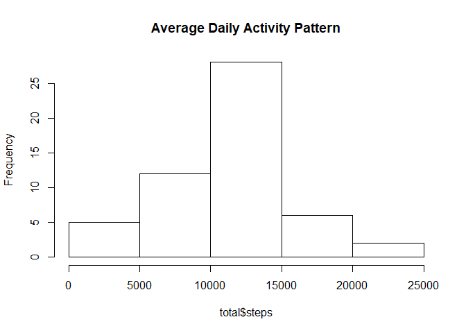
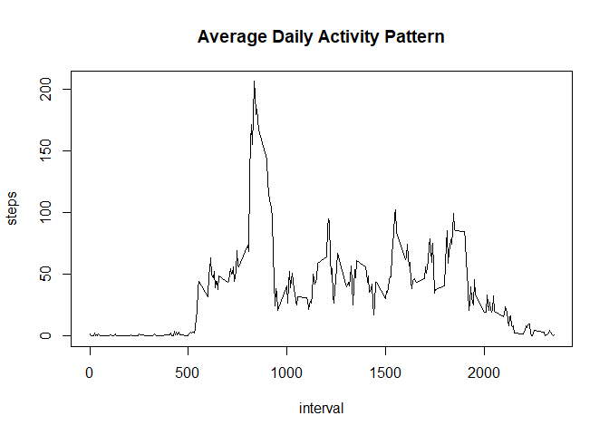
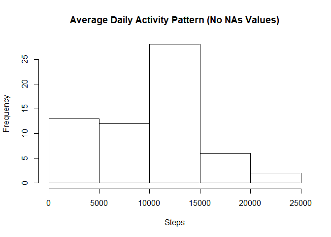
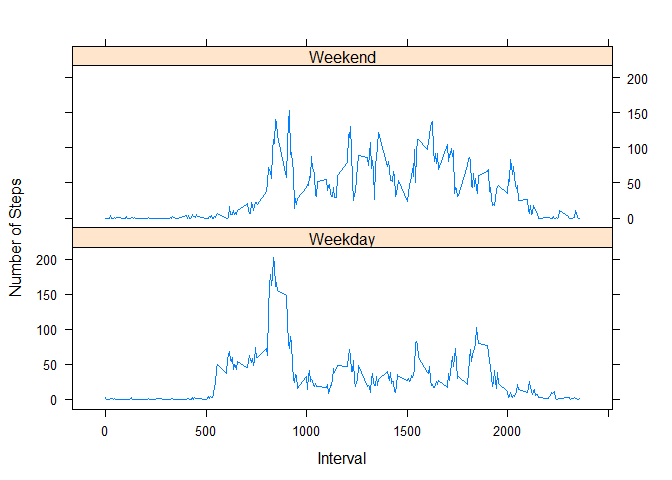

Author : Faizal Bin Ag Salleh

## Loading and preprocessing the data


```r
actData <- read.csv("activity.csv")
```


## What is mean total number of steps taken per day?

```r
# get total of steps taken by date
total <- aggregate(steps ~ date, actData, sum, na.rm=TRUE)

# plot histogram of total step taken pe day
hist(total$steps, main="Average Daily Activity Pattern")
```

<!-- -->

```r
# calculate mean and median
meanTotal <- mean(total$steps)
medianTotal <- median(total$steps)
```

The mean and median of the total step taken per day is **1.0766189\times 10^{4}** and **10765**


## What is the average daily activity pattern?

```r
# calculate average number of step
averageAct <- aggregate(steps ~ interval, actData, mean, na.rm=TRUE)

# plot average daily activity
with(averageAct, plot(interval, steps, type="l", main="Average Daily Activity Pattern"), xlab="Interval", ylab="Average Steps Taken")
```

<!-- -->

```r
# calculate what interval contain the maximum steps
maxSteps <- averageAct$interval[which.max(averageAct$steps)]
```

The maximum number of steps is on **835** of 5-minutes interval 


## Imputing missing values

```r
# Counting numbers of NA values in steps column
naCount <- sum(is.na(actData$steps))
```

Numbers of NA value in column steps is **2304**

Creating a new dataset by inputing NAs value with the mean of steps taken for that particular day

```r
# Change NA value with the mean of steps on that day
dailyMean <- aggregate(steps ~ date, actData, mean, na.rm=TRUE)

# change column name for successfull merging data
colnames(dailyMean) <- c("date", "meanstep")

# merging activity data with the mean of steps per day data
newActData <- merge(actData, dailyMean, sort=FALSE, all=TRUE)

# change NA value on mean.step to 0 (because there are no steps taken for every interval on that day)
newActData$meanstep[is.na(newActData$meanstep)] <- 0

# inputing steps NA value with the mean of steps on that day
newActData[is.na(newActData$steps), "steps"] <- newActData[is.na(newActData$steps), "meanstep"]

# get a new total of steps taken by date for the new data
newTotal <- aggregate(steps ~ date, newActData, sum)
```

plot histogram of new total step taken each day by using base plot function 

```r
hist(newTotal$steps, main="Average Daily Activity Pattern (No NAs Values)", xlab="Steps")
```

<!-- -->

Calculate the mean and median of the new activity dataset

```r
meanNewTotal <- mean(newTotal$steps)
medianNewTotal <- median(newTotal$steps)
```

The mean and median of the new total step taken per day is **9354.2295082** and **1.0395\times 10^{4}**


## Are there differences in activity patterns between weekdays and weekends?


```r
# loading lattice labrary
library(lattice)
```

Creating new factor variable to indicate weekend or weekday for the date in newActData dataset. 

```r
# change class factor of date to class date (cannot use weekdays function for class factor)
newActData$date <- as.Date(newActData$date)

# add new factor variable weekday classification in newActData
newActData$weekday <- ifelse(weekdays(newActData$date) %in% c("Saturday", "Sunday"), "Weekend", "Weekday")
newActData$weekday <- as.factor(newActData$weekday)

# getting average steps taken by interval
newAverage=daytype <- aggregate(steps ~ weekday + interval, newActData, mean)
```

Plotting a graph for numbers of steps taken for every interval consist on type of day using xyplot function from lattice to get the same result as example given for the project

```r
p <- xyplot(steps ~ interval | weekday, data = newAverage, layout=c(1,2), type="l", xlab = "Interval", ylab = "Number of Steps")
print(p)
```

<!-- -->

